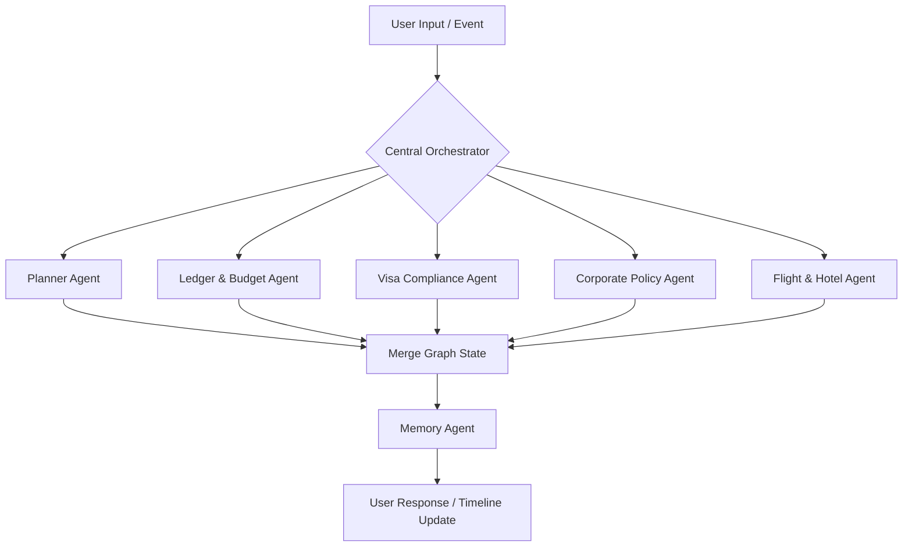

# AI Agent Orchestration - Kova

This document describes Kova's multi-agent orchestration architecture. Instead of a monolithic prompt, Kova implements a specialized multi-agent graph system using **LangGraph**. A central Orchestrator handles user queries and routes them dynamically to domain-specific sub-agents.

---

## 1. Orchestration Architecture

All specialized agents communicate through a shared state interface. Agents do not execute directly in a linear chain; instead, they act as nodes in a graph with dynamic routing conditions based on the user's intent, the journey context, and corporate policy validation.



---

## 2. Specialized Agents

Kova includes 17 specialized agents, each managing a focused piece of domain logic:

| Agent Name | Primary Responsibility | Associated Tools / Integrations |
| :--- | :--- | :--- |
| **Planner Agent** | Drafts and modifies journey timelines | OpenAI GPT-4o, Calendar API |
| **Destination Agent** | Discovers locations, points of interest, transit routes | Google Places, Maps API |
| **Budget Agent** | Optimizes pricing strategy, estimates journey cost caps | Local DB, Historical Cost Indexes |
| **Visa Agent** | Cross-references traveler nationality with itinerary destinations | Visa requirement DB, Passport scanner |
| **Flight Agent** | Queries flights, filters routes, suggests flight classes | Flight GDS Adapter |
| **Hotel Agent** | Evaluates hotels, room sizes, star ratings, amenities | Hotel GDS Adapter |
| **Activity Agent** | Suggests tours, events, booking platforms | Activity GDS Adapter |
| **Weather Agent** | Analyzes climate metrics, suggests optimal packing | Weather API Adapter |
| **Finance Agent** | Analyzes spending patterns, forecasts cash flows | Database Ledger |
| **Ledger Agent** | Balances splits, calculates settlement lists, reconciles debt | Database Ledger |
| **Receipt Agent** | Extracts receipt variables, matches transactions, auto-categorizes | OpenAI OCR Pipeline |
| **Corporate Policy Agent**| Audits requests against corporate budgets and travel policies | Travel Policy DB |
| **Approval Agent** | Renders approval recommendations for managers | Approval Chain DB |
| **Recommendation Agent**| Curates dining, relaxation, and local transit choices | Recommendation DB |
| **Memory Agent** | Tracks traveler preferences (airlines, seat type, hotel stars) | AI Memory Store |
| **Notification Agent** | Pushes notifications, updates travel alerts | SMS / Push Adapter |
| **Analytics Agent** | Summarizes organizational metrics and carbon emissions | Analytics Engine |

---

## 3. LangGraph State Schema

The orchestrator state contains the conversation history, the active journey details, and validation statuses:

```python
from typing import List, Dict, Any, Optional
from pydantic import BaseModel, Field

class JourneyState(BaseModel):
    messages: List[Dict[str, Any]] = Field(default_factory=list)
    journey_id: Optional[str] = None
    user_id: str
    active_agent: Optional[str] = None
    extracted_data: Dict[str, Any] = Field(default_factory=dict)
    validation_errors: List[str] = Field(default_factory=list)
    is_compliant: bool = True
    next_step: Optional[str] = None
```

---

## 4. Execution Workflow Example

### Scenario: Corporate Travel Booking Request
1. **User Request**: *"Book a flight to Paris for the AI Conference next month."*
2. **Orchestrator Node**:
   - Parses intent: Travel Request -> destination: Paris, date: next month, reason: conference.
   - Routes to **Planner Agent** to create a mock timeline.
3. **Planner Agent Node**:
   - Populates destination & date ranges.
   - Queries **Flight Agent** and **Hotel Agent** for estimates.
4. **Corporate Policy Node**:
   - Intercepts proposed flights.
   - Evaluates the employee's department policy (e.g., max flight class: *Economy*, flight cost < *$1500*).
   - If compliant, updates `is_compliant = True`.
5. **Approval Node**:
   - Generates approval payload.
   - Saves to `approvals` table.
   - Flags the **Notification Agent** to ping the department manager.
6. **Orchestrator Node**:
   - Synthesizes summary: *"I've drafted a compliant business trip to Paris for Oct 12-16. Total cost estimate is $1,200. This has been sent to your manager for approval."*
