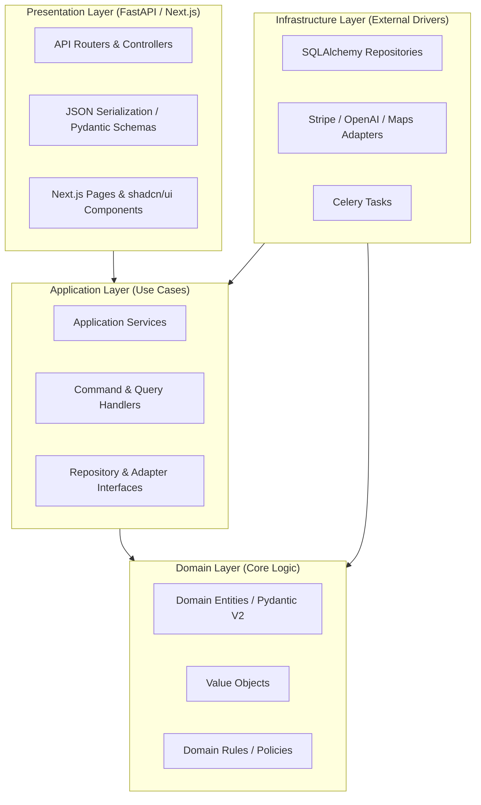

# System Architecture - Kova

This document defines the architectural guidelines, structure, and design patterns of Kova. The project is designed with strict **Clean Architecture** principles to separate core business logic from framework-dependent code.

---

## 1. Architectural Layers

Kova is structured into four main layers, enforcing a one-way dependency flow: **Presentation -> Application -> Infrastructure -> Domain**.

### 1.1 Domain Layer
- **No external dependencies** (other than standard library utilities and lightweight structures like Pydantic V2).
- Contains enterprise-wide business rules, interfaces, and core domain entities (e.g., `Journey`, `Expense`, `Member`).
- All validation rules reside here.

### 1.2 Application Layer
- Coordinates the flow of data to and from the domain entities.
- Implements use cases (e.g., `CreateJourneyUseCase`, `ProcessContributionUseCase`).
- Defines interfaces (Ports) for persistence (Repositories) and external integrations (e.g., `PaymentGatewayInterface`, `EmailSenderInterface`).

### 1.3 Infrastructure Layer
- Contains concrete implementations of repository interfaces (using SQLAlchemy and PostgreSQL).
- Hosts external API adapters (Stripe, Yoco, Ozow, OpenAI, Google Maps, Amadeus, Twilio).
- Manages database configuration, migrations (Alembic), Celery tasks, and caching patterns (Redis).

### 1.4 Presentation Layer
- **Backend (FastAPI)**: HTTP controllers, routers, authentication middleware, request validation models, and exceptions handling.
- **Frontend (Next.js)**: App Router structures, component layout, global state provider, React Query caching, and tailwind styling.

---

## 2. Technology Stack Mapping

| Layer / Concern | Technology | Purpose |
| :--- | :--- | :--- |
| **Frontend UI** | Next.js (App Router), TypeScript | User application interface |
| **Frontend Styling** | Tailwind CSS, shadcn/ui, Framer Motion | Premium look, smooth animations |
| **State & API cache**| React Query, React Hook Form | Frontend state synchronisation |
| **Backend REST API** | FastAPI, Python | Fast, asynchronous web framework |
| **Domain Modeling** | Pydantic V2 | Strong runtime data validation |
| **Database ORM** | SQLAlchemy 2.0 | Advanced relational database mapping |
| **Database Migrations**| Alembic | Incremental SQL schema management |
| **Main Database** | PostgreSQL | Relational transactional ledger store |
| **Cache & Message Broker**| Redis | Session cache and Celery queue |
| **Background Tasks** | Celery | Async receipt processing, webhooks, notifications |
| **AI Orchestration** | LangGraph, OpenAI SDK | Decoupled multi-agent execution graphs |
| **Deployment & Infra** | Docker, AWS (S3, CloudFront), Terraform | Infrastructure as Code and cloud setup |

---

## 3. Communication Patterns

### 3.1 Synchronous Actions (HTTP/WebSockets)
- Frontend issues requests to FastAPI API routers.
- Middleware handles JWT auth verification and sets the context.
- Controller invokes the appropriate Use Case.
- Use Case queries DB through repository interfaces, applies rules, performs transactions, and returns response.

### 3.2 Asynchronous Tasks (Celery & Redis)
- Time-consuming tasks (AI receipt scans, generating full itineraries, sending emails, processing payments) are pushed to the Redis message queue.
- Celery worker pools pick up tasks, execute them using Infrastructure adapters, and optionally update clients using a WebSocket connection.

### 3.3 Payment Provider Integration (Webhooks)
- Payment providers (Stripe/Ozow/Yoco) trigger callback endpoints.
- FastAPI presentation controllers validate signatures and delegate the execution to `ProcessContributionUseCase`.
- Use Case increments the local balance inside the database, updates the ledger, and alerts members via WebSockets.
