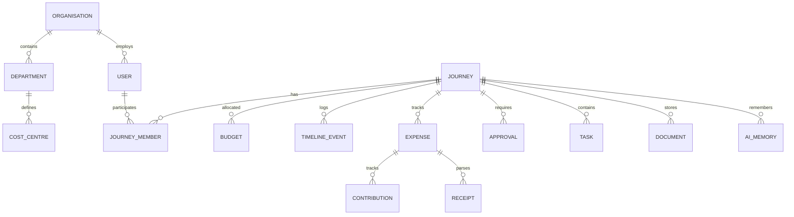

# Database Design - Kova

This document defines the relational database schema for Kova. The database engine is PostgreSQL. 

---

## 1. Entity Relationship Overview

The schema is built around the **Journey** as the central entity. Relational constraints and cascading delete behaviors are set up to maintain strict data integrity.

---

## 2. Table Definitions

### 2.1 Core Identity & Organizations

#### `users`
Represents login identity and system roles.
- `id` (UUID, Primary Key)
- `email` (VARCHAR, Unique, Indexed)
- `hashed_password` (VARCHAR)
- `system_role` (VARCHAR) - `admin`, `user`, `travel_agent`
- `created_at` (TIMESTAMP WITH TIME ZONE)
- `updated_at` (TIMESTAMP WITH TIME ZONE)

#### `organisations`
For corporate clients using Kova.
- `id` (UUID, Primary Key)
- `name` (VARCHAR)
- `domain` (VARCHAR, Unique)
- `created_at` (TIMESTAMP WITH TIME ZONE)

#### `departments`
Departments inside an organization.
- `id` (UUID, Primary Key)
- `organisation_id` (UUID, Foreign Key -> `organisations.id`)
- `name` (VARCHAR)
- `manager_id` (UUID, Foreign Key -> `users.id`)

#### `cost_centres`
For routing travel expenses to corporate budgets.
- `id` (UUID, Primary Key)
- `department_id` (UUID, Foreign Key -> `departments.id`)
- `code` (VARCHAR, Unique)
- `name` (VARCHAR)
- `allocated_budget` (DECIMAL(12, 2))
- `spent_budget` (DECIMAL(12, 2))

#### `profiles`
User profiles (personal/corporate details).
- `id` (UUID, Primary Key)
- `user_id` (UUID, Foreign Key -> `users.id`, Unique)
- `organisation_id` (UUID, Foreign Key -> `organisations.id`, Nullable)
- `department_id` (UUID, Foreign Key -> `departments.id`, Nullable)
- `first_name` (VARCHAR)
- `last_name` (VARCHAR)
- `phone_number` (VARCHAR, Nullable)
- `passport_number` (VARCHAR, Nullable)
- `passport_expiry` (DATE, Nullable)
- `country_code` (VARCHAR(3))

---

### 2.2 Journey Module

#### `journey_types`
Dynamic list of supported journey configurations.
- `id` (UUID, Primary Key)
- `code` (VARCHAR, Unique) - `holiday`, `business_trip`, etc.
- `name` (VARCHAR)
- `description` (TEXT)

#### `journeys`
The core object of the platform.
- `id` (UUID, Primary Key)
- `title` (VARCHAR)
- `journey_type_id` (UUID, Foreign Key -> `journey_types.id`)
- `organisation_id` (UUID, Foreign Key -> `organisations.id`, Nullable)
- `cost_centre_id` (UUID, Foreign Key -> `cost_centres.id`, Nullable)
- `start_date` (DATE)
- `end_date` (DATE)
- `status` (VARCHAR) - `planning`, `active`, `completed`, `cancelled`
- `created_at` (TIMESTAMP WITH TIME ZONE)

#### `journey_members`
Association table linking users to journeys.
- `id` (UUID, Primary Key)
- `journey_id` (UUID, Foreign Key -> `journeys.id`, On Delete Cascade)
- `user_id` (UUID, Foreign Key -> `users.id`)
- `role` (VARCHAR) - `member`, `treasurer`, `coordinator`, `viewer`
- `joined_at` (TIMESTAMP WITH TIME ZONE)
- *Constraint*: Unique index on `(journey_id, user_id)`

---

### 2.3 Bookings & Timeline

#### `timeline_events`
Chronological journey timeline event cards.
- `id` (UUID, Primary Key)
- `journey_id` (UUID, Foreign Key -> `journeys.id`, On Delete Cascade)
- `title` (VARCHAR)
- `description` (TEXT, Nullable)
- `start_time` (TIMESTAMP WITH TIME ZONE)
- `end_time` (TIMESTAMP WITH TIME ZONE)
- `event_type` (VARCHAR) - `flight`, `hotel`, `activity`, `custom`
- `reference_id` (UUID, Nullable) - Links to flight/hotel/activity records.

#### `flights`
Flight bookings details.
- `id` (UUID, Primary Key)
- `timeline_event_id` (UUID, Foreign Key -> `timeline_events.id`, Nullable)
- `carrier` (VARCHAR)
- `flight_number` (VARCHAR)
- `departure_airport` (VARCHAR(4))
- `arrival_airport` (VARCHAR(4))
- `booking_reference` (VARCHAR)
- `seat_number` (VARCHAR, Nullable)
- `cabin_class` (VARCHAR)
- `cost` (DECIMAL(10, 2))
- `currency` (VARCHAR(3))

#### `hotels`
Hotel/accommodation reservations.
- `id` (UUID, Primary Key)
- `timeline_event_id` (UUID, Foreign Key -> `timeline_events.id`, Nullable)
- `hotel_name` (VARCHAR)
- `address` (TEXT)
- `check_in` (TIMESTAMP WITH TIME ZONE)
- `check_out` (TIMESTAMP WITH TIME ZONE)
- `booking_reference` (VARCHAR)
- `room_number` (VARCHAR, Nullable)
- `cost` (DECIMAL(10, 2))
- `currency` (VARCHAR(3))

#### `activities`
Planned tours, tasks, and excursions.
- `id` (UUID, Primary Key)
- `timeline_event_id` (UUID, Foreign Key -> `timeline_events.id`, Nullable)
- `name` (VARCHAR)
- `location` (TEXT)
- `cost` (DECIMAL(10, 2))
- `currency` (VARCHAR(3))

---

### 2.4 Ledgers, Expenses & Payments

#### `journey_ledgers`
Main transaction ledger summary of a journey.
- `id` (UUID, Primary Key)
- `journey_id` (UUID, Foreign Key -> `journeys.id`, Unique, On Delete Cascade)
- `treasurer_id` (UUID, Foreign Key -> `users.id`)
- `total_budget` (DECIMAL(12, 2))
- `total_spent` (DECIMAL(12, 2))
- `currency` (VARCHAR(3))

#### `expenses`
Logs individual expenses belonging to a journey.
- `id` (UUID, Primary Key)
- `journey_id` (UUID, Foreign Key -> `journeys.id`, On Delete Cascade)
- `payer_id` (UUID, Foreign Key -> `users.id`)
- `amount` (DECIMAL(12, 2))
- `currency` (VARCHAR(3))
- `exchange_rate` (DECIMAL(10, 6)) - Rate to default ledger currency
- `category` (VARCHAR) - `accommodation`, `transport`, `food`, `visa`, `other`
- `description` (TEXT)
- `expense_date` (DATE)
- `created_at` (TIMESTAMP WITH TIME ZONE)

#### `expense_splits`
How a specific expense is split among members.
- `id` (UUID, Primary Key)
- `expense_id` (UUID, Foreign Key -> `expenses.id`, On Delete Cascade)
- `user_id` (UUID, Foreign Key -> `users.id`)
- `share_amount` (DECIMAL(12, 2))
- `settled` (BOOLEAN, Default False)

#### `contributions`
Financial transactions towards the Treasurer.
- `id` (UUID, Primary Key)
- `journey_id` (UUID, Foreign Key -> `journeys.id`, On Delete Cascade)
- `user_id` (UUID, Foreign Key -> `users.id`)
- `amount` (DECIMAL(12, 2))
- `currency` (VARCHAR(3))
- `payment_provider` (VARCHAR) - `stripe`, `yoco`, `ozow`, `manual`
- `provider_transaction_id` (VARCHAR, Unique, Nullable)
- `status` (VARCHAR) - `pending`, `completed`, `failed`
- `created_at` (TIMESTAMP WITH TIME ZONE)
- `settled_at` (TIMESTAMP WITH TIME ZONE, Nullable)

#### `receipts`
Metadata for uploaded and AI-scanned receipts.
- `id` (UUID, Primary Key)
- `expense_id` (UUID, Foreign Key -> `expenses.id`, Nullable, On Delete Cascade)
- `uploader_id` (UUID, Foreign Key -> `users.id`)
- `file_url` (VARCHAR) - Path to S3 storage bucket
- `ocr_status` (VARCHAR) - `pending`, `processed`, `failed`
- `extracted_merchant` (VARCHAR, Nullable)
- `extracted_amount` (DECIMAL(12, 2), Nullable)
- `extracted_tax` (DECIMAL(12, 2), Nullable)
- `extracted_currency` (VARCHAR(3), Nullable)
- `extracted_date` (DATE, Nullable)
- `ocr_payload` (JSONB, Nullable)

---

### 2.5 Compliance, Collaboration & Workflows

#### `documents`
User travel documents (Visas, Insurance, Passports).
- `id` (UUID, Primary Key)
- `journey_id` (UUID, Foreign Key -> `journeys.id`, Nullable)
- `user_id` (UUID, Foreign Key -> `users.id`)
- `document_type` (VARCHAR) - `visa`, `passport`, `insurance`, `other`
- `file_url` (VARCHAR)
- `expiry_date` (DATE, Nullable)
- `meta` (JSONB) - Dynamic metadata like visa entry rules.

#### `tasks`
Task tracking board for journey preparations.
- `id` (UUID, Primary Key)
- `journey_id` (UUID, Foreign Key -> `journeys.id`, On Delete Cascade)
- `title` (VARCHAR)
- `assigned_to` (UUID, Foreign Key -> `users.id`, Nullable)
- `status` (VARCHAR) - `todo`, `in_progress`, `done`
- `due_date` (DATE, Nullable)

#### `votes`
Feature mapping to journey proposals/polls.
- `id` (UUID, Primary Key)
- `journey_id` (UUID, Foreign Key -> `journeys.id`, On Delete Cascade)
- `question` (VARCHAR)
- `options` (JSONB) - Option list (e.g. `["Hotel A", "Hotel B"]`)
- `status` (VARCHAR) - `open`, `closed`

#### `user_votes`
Individual user choices.
- `id` (UUID, Primary Key)
- `vote_id` (UUID, Foreign Key -> `votes.id`, On Delete Cascade)
- `user_id` (UUID, Foreign Key -> `users.id`)
- `selected_option` (VARCHAR)
- `voted_at` (TIMESTAMP WITH TIME ZONE)

#### `travel_policies`
Corporate compliance constraints.
- `id` (UUID, Primary Key)
- `organisation_id` (UUID, Foreign Key -> `organisations.id`)
- `max_flight_class` (VARCHAR) - `economy`, `business`, `first`
- `max_hotel_star_rating` (INTEGER)
- `max_daily_budget` (DECIMAL(10, 2))
- `require_approval` (BOOLEAN)

#### `approvals`
Workflow states for journeys requiring management sign-off.
- `id` (UUID, Primary Key)
- `journey_id` (UUID, Foreign Key -> `journeys.id`, On Delete Cascade)
- `approver_id` (UUID, Foreign Key -> `users.id`)
- `status` (VARCHAR) - `pending`, `approved`, `rejected`
- `comments` (TEXT, Nullable)
- `reviewed_at` (TIMESTAMP WITH TIME ZONE, Nullable)

---

### 2.6 AI System & Analytics

#### `ai_memories`
Context memory saved by AI agents for travelers.
- `id` (UUID, Primary Key)
- `user_id` (UUID, Foreign Key -> `users.id`)
- `memory_key` (VARCHAR) - e.g. `preferred_airlines`
- `memory_value` (TEXT)
- `context_metadata` (JSONB, Nullable)
- `updated_at` (TIMESTAMP WITH TIME ZONE)

#### `audit_logs`
Security compliance logging.
- `id` (UUID, Primary Key)
- `user_id` (UUID, Foreign Key -> `users.id`, Nullable)
- `action` (VARCHAR)
- `entity_type` (VARCHAR)
- `entity_id` (UUID, Nullable)
- `details` (JSONB, Nullable)
- `ip_address` (VARCHAR, Nullable)
- `created_at` (TIMESTAMP WITH TIME ZONE)
